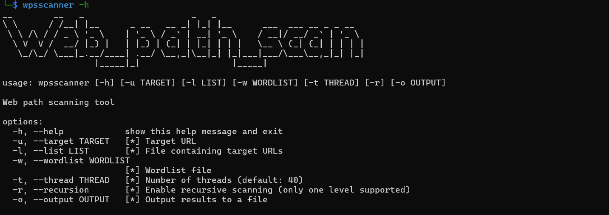

### Introduction

​	wpsscanner is a simple, small demo with limited functionality. Compared to traditional Web path scanners, it improves the recognition of "pseudo-404" pages, thereby reducing false positives.


### Installation

```

git clone https://github.com/kaixliu56/wpsscanner.git

cd wpsscanner

pip install -r requirements.txt

```

### usage 

```
wpsscanner -h/--help
```

